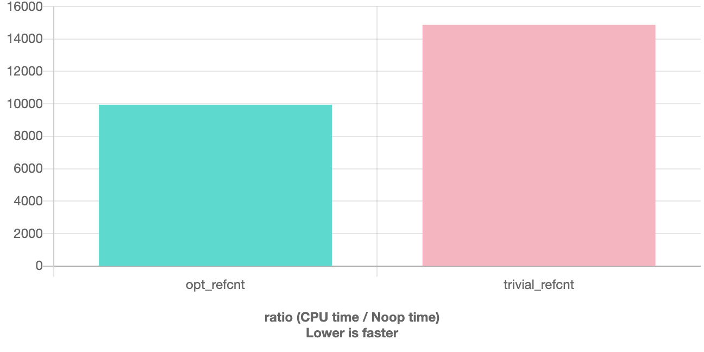
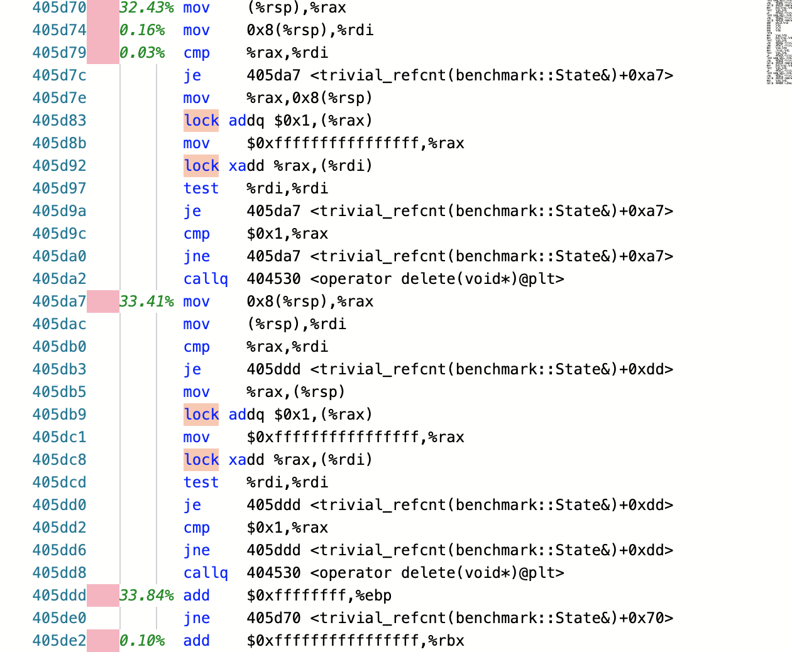
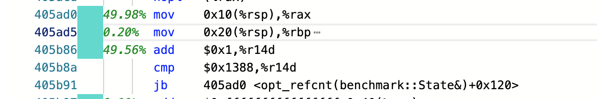
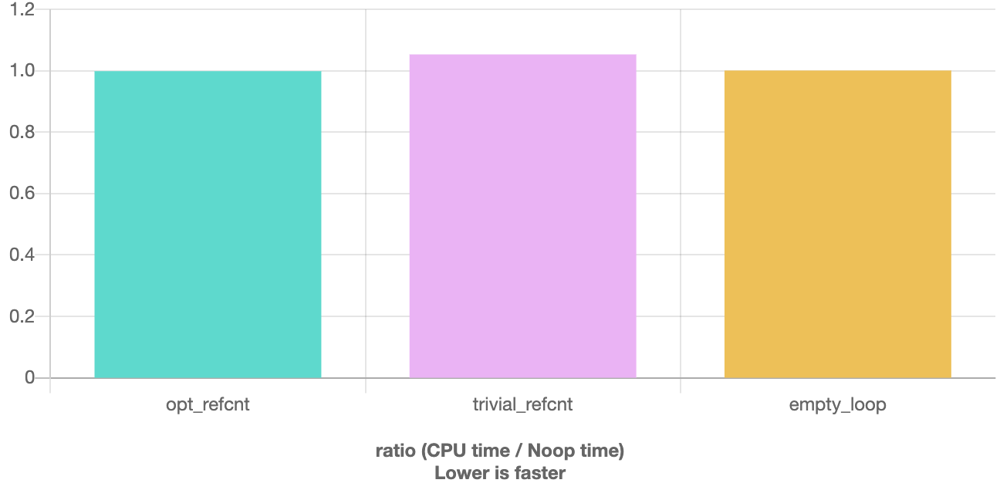

# OptimizedThreadSafeRefCounting

## What kind of optimization

> `#define cnter counter`

- `Unsafe`：Ignore thread safety.
- `Trivial`: Use atomics directly.
- `Optimized`: Use 2 kinds of counter:
  - If 2 `ref_cnter`s are in the same threads, we can use local cnter.
  - Once when the local cnter is 0, we subtract the expensive global atomic cnter.

## Result for Benchmark

I test the performance of different `ref_cnter`s. 

> Options: 
>
> - LIBC++(LLVM)
> - STD=C++20
> - OPTIM: O3
> - COMPILER: CLANG-8.0

> Optimized version is **1.5x** faster.




Acctually multi-threading performance is very hard to messure(as the overhead of creating a thread is a bit huge to the `ref_cnter`'s operations). So I tested it in single-thread case. But they're equal as the aim of benchmark is how many benefits we can take when we are "local".

## Code for Benchmark

> [C++ Quick Bench](http://quick-bench.com/)
>
> Please add the `ref_cnter` class before using the following codes.

```c++
constexpr std::size_t sz = 5000;

static void opt_refcnt(benchmark::State& state) {
  using namespace ganler::opt;
  ref_cnter cnter;
  ref_cnter cnter_;
  benchmark::DoNotOptimize(cnter);
  benchmark::DoNotOptimize(cnter_);
  for (auto _ : state) {
    { // Test passed.
      cnter = cnter_;
      cnter_ = cnter;
    }
  }
}
BENCHMARK(opt_refcnt);

static void trivial_refcnt(benchmark::State& state) {
  using namespace ganler::trivial;
  ref_cnter cnter;
  ref_cnter cnter_;
  benchmark::DoNotOptimize(cnter);
  benchmark::DoNotOptimize(cnter_);
  for (auto _ : state) {
    { // Test passed.
      cnter = cnter_;
      cnter_ = cnter;
    }
  }
}
// Register the function as a benchmark
BENCHMARK(trivial_refcnt);
```

## Details

We can see that the assembly of the benchmark:

#### For trivial implementation atomic operation is the bottleneck.



#### For optimized version ++/-- is no longer the bottleneck



> Note that `405b86` is related to the for-loop stuff.

#### And GCC

Acctually I cannot understand the results of GCC 9.1. Optimized version is just **1.1x** faster.

(Maybe gcc considered the optimization for local atomic operation).

(But the optimized version is as fast as the empty loop).

